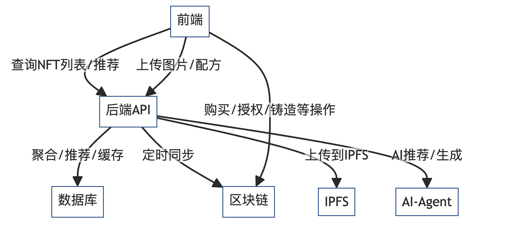

# Bars Help Bars - 产品需求文档

# 以太坊测试链合约地址
部署者地址: 0xffEa650e76B756aBAb614CC0143210eEB7813Bea
CA1:0x33E309CA718747dc881Cc8E900DD5b3b60a39B18
CA2:0x7C25cdC826C467B6b3856B48F54BD14cF3202411
CA4:0xe7482833c9A590BF23687dd7d09c8D586577AB97

# Injective测试链合约地址
MockUSDT: 0x81DDAf3D421BD54EdeBdE08C00EF59dA2464b927
IDNFT6551: 0xc4971cd7ef0fC14bd3b3Af97ECC85A298475B4Ff
RecipeNFT: 0x2AF8d627E7767411093163a8a2bCfEd581f8E98b
RecipeMarketplace: 0x03bEdd3242b625a8Ce602137314901D77Bc26503

## 项目概述
**项目名称**: Bars Help Bars  
**项目类型**: Web3 酒吧生态系统  

## 功能模块一：NFT授权交易系统

### 1. 系统架构
本系统基于两个核心NFT构建：
- **ID NFT** (ERC 6551): 酒吧身份认证与授权管理
- **Recipe NFT** (ERC 4907): 鸡尾酒配方知识产权管理

### 2. 数据结构定义

#### 2.1 NFT系列说明
- **ID NFT系列**: 所有ID NFT属于同一个NFT系列，用于统一管理酒吧身份认证
- **Recipe NFT系列**: 每个ID NFT所创建的Recipe NFT属于同一个系列，便于配方知识产权的统一管理

#### 2.2 ID NFT 数据结构 (ERC 6551)
```json
{
  "metadata": {
    "mutable": true,
    "barPhoto": "String(URL)",
    "barName": "String", 
    "barLocation": "String",
    "barIntro": "String"
  }
}
```

#### 2.3 Recipe NFT 数据结构 (ERC 4907)
```json
{
  "metadata": {
    "mutable": false,
    "cocktailName": "String",
    "cocktailIntro": "String", 
    "cocktailPhoto": "String(URL)",
    "private": {
      "cocktailRecipe": "String",
      "recipePhoto": "String(URL)"
    }
  }
}
```
数据结构并非最终版本 仅供参考

### 3. 核心功能需求

#### 3.1 用户身份认证与ID NFT管理

**功能描述**: 用户通过MetaMask登录系统，系统验证用户是否持有ID NFT，如无则引导用户创建

**详细流程**:
1. **MetaMask连接验证**
   - 用户点击"连接钱包"按钮
   - 系统调用MetaMask API进行钱包连接
   - 验证连接状态和账户有效性

2. **ID NFT持有验证**
   - 系统查询用户钱包地址是否持有ID NFT
   - 检查ID NFT的有效性和所有权状态

3. **ID NFT创建流程** (如用户未持有)
   - 引导用户填写酒吧信息表单
   - 表单字段包括：酒吧照片、酒吧名称、位置、简介
   - 用户确认信息后，系统调用智能合约铸造ID NFT
   - 合约自动将ID NFT空投至用户钱包地址

**技术要求**:
- 支持MetaMask钱包连接
- 智能合约实现ERC 4907标准
- 前端表单验证与数据格式化
- Gas费用估算与用户确认

#### 3.2 Recipe NFT创建与铸造

**功能描述**: 酒吧用户可以创建并铸造自己的鸡尾酒配方NFT

**详细流程**:
1. **配方信息录入**
   - 用户填写鸡尾酒配方信息表单
   - 必填字段：鸡尾酒名称、简介、照片
   - 私有字段：详细配方、配方照片（仅授权用户可见）

2. **NFT铸造流程**
   - 系统验证表单数据完整性
   - 调用智能合约mint Recipe NFT
   - 合约自动将Recipe NFT空投给用户的ID NFT
   - ID NFT作为Recipe NFT的owner

**技术要求**:
- 表单数据验证与格式化
- 图片上传与IPFS存储
- 智能合约铸造逻辑
- 元数据标准化处理

#### 3.3 Recipe NFT定价与上架

**功能描述**: Recipe NFT持有者可以设置价格并将配方设置为可授权状态

**详细流程**:
1. **价格设置**
   - Recipe NFT owner选择要出售的Recipe NFT
   - 设置授权价格（USDT计价）
   - 确认价格设置

2. **上架操作**
   - 将Recipe NFT状态设置为"待出售"
   - 在市场中展示该Recipe NFT

**技术要求**:
- USDT价格设置与验证
- 市场展示界面
- 价格显示与格式化

#### 3.4 Recipe NFT授权购买

**功能描述**: 持有ID NFT的酒吧可以购买其他酒吧的Recipe NFT授权

**详细流程**:

1. **支付与授权**
   - 选择目标Recipe NFT
   - 用户通过MetaMask确认USDT支付
   - 智能合约验证支付金额
   - 合约将用户ID NFT添加到Recipe NFT的授权用户列表
   - 用户获得访问私有配方信息的权限

**技术要求**:
- USDT支付集成
- 智能合约授权逻辑
- 用户权限管理
- 交易状态跟踪

### 4. 用户界面需求
- 登陆界面
- 创建ID NFT界面
- 主界面
    - 包括左侧侧边栏和右侧recipe浏览
    - 左侧包括账户信息，My Recipe, My Bar, Create Recipe等功能
    - 右侧有市场浏览功能，页面仿照OpenSea
- 创建Recipe NFT界面
- 出售Recipe NFT使用权界面
- 购买Recipe NFT使用权界面

### 5. AI设计Bar
待处理 先不需要管 先实现其他功能

## 目前的架构
1. 智能合约（Solidity）
   * ID NFT（ERC-6551，酒吧身份）IDNFT.sol
   * Recipe NFT（ERC-4907，配方知识产权+授权）RecipeNFT.sol
   * 授权/交易逻辑（USDT支付、授权关系）Marketplace.sol
2. 前端（React/Vue/Next.js等）
   * 钱包连接（MetaMask）
   * NFT创建/展示/交易页面
   * 授权购买流程
   * 市场浏览（仿OpenSea）
3. 后端（可能要）
   * AI Agents
   * IPFS上传代理
   * 统计与分析

4. 去中心化存储
   * IPFS（存储图片、配方等大文件）


-----
<a href="https://github.com/west0nG/ADVX25/graphs/contributors">
  
</a>

Made with [contrib.rocks](https://contrib.rocks).


# AI Agent
- 输入内容
   - 输入 你的酒吧开在哪里
   - 输入 你的酒吧希望什么风格
      - 可选 日式调酒 美式调酒 英式调酒 拉美调酒
   - 输入 你的酒吧的主题
      - belike 植物 四季 天空 东方快车谋杀案
   - 输入 你的预算

- 输出 装修和设计建议 文字
- 输出 推荐买的酒谱
